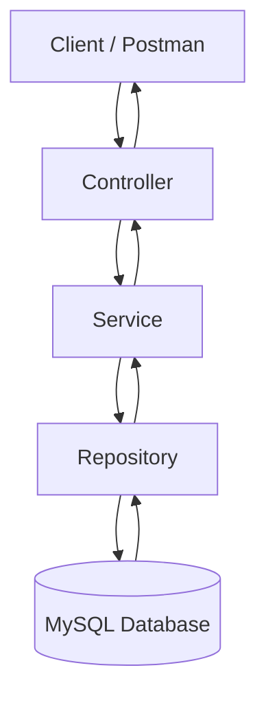
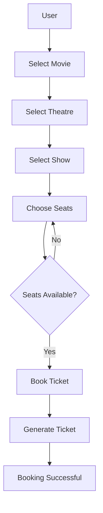

# 🎬 BookMyShow

A backend REST API application inspired by BookMyShow, built using **Spring Boot** with an industry-standard layered architecture.


---

## 📑 Table of Contents

- [Project Overview](#-project-overview)
- [Features](#-features)
- [Tech Stack](#-tech-stack)
- [Architecture](#-architecture)
- [Ticket Booking Flow](#-ticket-booking-flow)
- [Project Structure](#-project-structure)
- [Database Design](#-database-design)
- [REST API Endpoints](#-rest-api-endpoints)
- [Installation & Setup](#-installation--setup)
- [Future Enhancements](#-future-enhancements)
- [Learning Outcomes](#-learning-outcomes)
- [Author](#-author)
- [License](#-license)

---

## 📖 Project Overview

**BookMyShow** is a backend application that simulates an online movie ticket booking platform. It lets users browse movies, choose a theatre and show, pick seats, and book tickets through REST APIs.

- **Why it was built:** To practice real-world backend development with Spring Boot, JPA/Hibernate and MySQL, following clean layered architecture.
- **What problem it solves:** Manages movies, theatres, shows, seats and bookings in one system, and prevents the same seat from being booked twice.
- **Main functionalities:** User management, movie and theatre management, show scheduling, seat availability and ticket booking.

---

## ✨ Features

### 👤 User Module
- Register user
- Login user
- View booking history
- Book tickets

### 🎥 Movie Module
- Add movie
- Update movie
- Delete movie
- View movies

### 🏢 Theatre Module
- Add theatre
- Manage theatre

### 🎭 Show Module
- Create show
- Manage shows

### 💺 Seat Module
- Seat allocation
- Seat availability
- Seat booking

### 🎫 Ticket Module
- Book ticket
- Generate ticket
- Cancel ticket

---

## 🛠 Tech Stack

| Category    | Technology        |
|-------------|-------------------|
| Language    | Java 17           |
| Framework   | Spring Boot       |
| ORM         | Hibernate         |
| Database    | MySQL             |
| Persistence | Spring Data JPA   |
| Build Tool  | Maven             |
| IDE         | IntelliJ IDEA     |
| API Testing | Postman           |

---

## 🏗 Architecture

The project follows a layered architecture:



| Layer      | Responsibility                                  |
|------------|-------------------------------------------------|
| Controller | Handles HTTP requests and responses             |
| Service    | Business logic                                  |
| Repository | Database access using Spring Data JPA           |
| Entity     | Maps Java classes to database tables            |
| DTO        | Carries data between client and server          |

---

## 🎫 Ticket Booking Flow



---

## 📂 Project Structure

```
BookMyShow/
├── src/
│   ├── main/
│   │   ├── java/NK/BookMyShow/
│   │   │   ├── config/
│   │   │   ├── controller/
│   │   │   ├── dto/
│   │   │   ├── entity/
│   │   │   ├── enums/
│   │   │   ├── exception/
│   │   │   ├──
